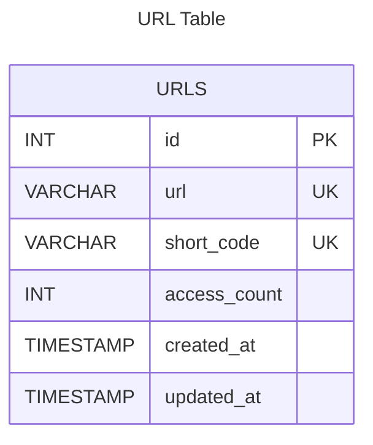

# Database E-R Diagram

```mermaid
---
title: URL Table
---
erDiagram
    URLS {
        INT id PK
        VARCHAR url UK
        VARCHAR short_code UK
        INT access_count
        TIMESTAMP created_at
        TIMESTAMP updated_at
    }
```
